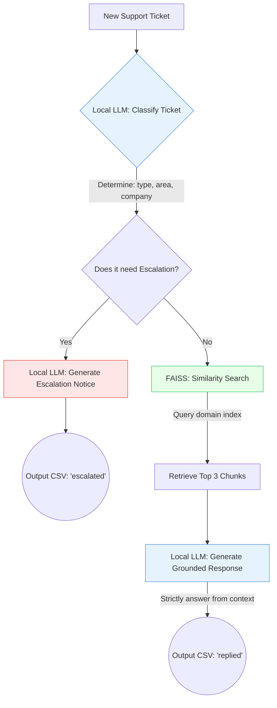

# Support Triage Agent (100% Local)

A high-performance, **100% local** terminal-based AI agent that triages support tickets across **HackerRank**, **Claude**, and **Visa**. It uses an entirely offline RAG architecture to ensure data privacy, utilizing local vector databases and local LLMs to classify, route, and generate grounded responses.

## Tech Stack

| Component | Technology |
|-----------|------------|
| Reasoning LLM | Local LLM via Ollama (e.g., `llama3` or `phi3`) |
| Embeddings | `sentence-transformers/all-MiniLM-L6-v2` |
| Framework | LangChain (`ChatOllama`, `HuggingFaceEmbeddings`) |
| Retrieval | Local FAISS |
| Terminal UI | Textual |
| Language | Python 3.10+ |

## Architecture & Flow Design

The agent processes each ticket through a strict deterministic pipeline ensuring accuracy and preventing hallucinations. 



## Setup & Requirements

Because this pipeline is **100% local**, you do **not** need any external API keys (no Google Gemini, no OpenAI, no Anthropic). You just need the local models.

### 1. Install Ollama & Pull the Model
Download [Ollama](https://ollama.com/) and pull the default model:
```bash
ollama run llama3
```

### 2. Install Python Dependencies
```bash
pip install -r requirements.txt
```

### 3. Build the Local FAISS Index
This step will automatically download the `all-MiniLM-L6-v2` embedding model (~80MB) and vectorize the markdown corpus.
```bash
python code/main.py --build-index
```

## Usage

### TUI Mode (default)
Launch the interactive terminal UI with live progress tracking. Press **S** to start, **V** to validate against the sample dataset.
```bash
python code/main.py
```

### Batch Mode
Processes all tickets from `support_tickets.csv` without the UI and writes to `output.csv`.
```bash
python code/main.py --batch
```

### Test a Specific Question
You can interactively test the agent's RAG and classification logic from the terminal:
```bash
python code/main.py --ask "how do I add a team member?" --company "hackerrank"
```
*(You can also use `--limit 1` combined with `--sample` to process just the first ticket).*

## File Structure

| File | Purpose |
|------|---------|
| `main.py` | CLI Entry point (TUI / batch / sample / build-index / ask) |
| `config.py` | Local model names (`LOCAL_LLM`), paths, chunking config |
| `loader.py` | Ingests the Markdown support corpus and applies recursive chunking |
| `indexer.py` | Builds local FAISS indices per domain |
| `retriever.py` | Loads FAISS indices and performs similarity searches |
| `chains.py` | Contains the LangChain `ChatOllama` prompts with Pydantic structured output |
| `agent.py` | The orchestrator that wires classification to retrieval to response |
| `tui.py` | The rich Textual-based terminal UI |
